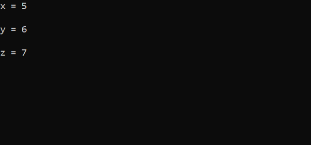

<!--a programme about pointer-->

P~~o~~_i_ __n__`ter`

---
- [x]
- [x]
- [x]

### component

<ol style="I">
<li>
<li>
</ol>

```c
#include<stdio.h>
int main()
{
    int x=5;

    int *ptr;

    ptr= &x;

    printf("x = %d\n",x);
    printf("&x = %d\n",&x);
    printf("ptr = %d\n",ptr);
    printf("*ptr = %d\n",*ptr);
    printf("&ptr = %d\n",&ptr);

    getch();
}
```  
<image src="./images/initial.png" width="500" title="initial"/>  

### basic practice

```c
#include<stdio.h>
int main()
{
    int x=5,y=6,z=7;
    int *ptr;

    ptr = &x;
    printf("x = %d\n\n",*ptr);

    ptr = &y;
    printf("y = %d\n\n",*ptr);

    ptr = &z;
    printf("z = %d\n\n",*ptr);

    getchar()
}
```  
<image src="./images/basic.png" width="500" title="basic"/>  

### similar

```c
#include<stdio.h>
int main()
{
    int x=4,y=5,z=6;

    int *a,*b,*c;

    a=&x;
    b=&y;
    c=&z;

    printf("x = %d\n\n",*a);
    printf("y = %d\n\n",*b);
    printf("z = %d\n\n",*z);

    getchar();
}
```
  

### adding two numbers using pointer

```c
#include<stdio.h>
int main()
{
    int x=5, y=6;

    int *ptr1,*ptr2;

    ptr1=&x;
    ptr2=&y;

    int sum = *ptr1+*ptr2;

    printf("Sum = %d\n\n",sum);

    getchar();
}
```  
<image src="./images/sum.png" width="500" height="100" border="5" alt="sum is not showing" vspace="10" hspace="10" align="top"/>  

### swap the value

```c
#include<stdio.h>
int main()
{
    int x=5, y=10,temp;
    int *ptr1,*ptr2;

    ptr1=&x;
    ptr2=&y;

    temp=*ptr1;
    *ptr1=*ptr2;
    *ptr2=temp;

    printf("x = %d\n\n",x);
    printf("y = %d\n\n",y);

    printf("*ptr1 = %d\n",*ptr1);
    printf("*ptr2 = %d\n",*ptr2);

    getch();
}
```  
<image src="./images/swap.png" width="500" title="swap"/>  

### swaping using pointer & function

```c
#include<stdio.h>
void swap(int *a,int *b)
{
    int temp;
    temp=*a;
    *a=*b;
    *b=temp;
}
int main()
{
    int x=5,y=10;
    printf("before swapping x = %d & y = %d",x,y);
    swap(&x,&y);
    printf("after swapping x = %d & y = %d",x,y);
}
```  
<image src="./images/swapfunction.png" width="500" title="swapfunction"/>  

### pointer with array

```c
#include<stdio.h>
int main()
{
    int a[]={10,20,30,40,50};
    int *ptr;
    ptr=&a[0];
    printf("ptr 1000+0*4 = %d\n",*(ptr+0));// *1000+0*4
    printf("ptr 1000+1*4 = %d\n",*(ptr+1));// *1000+1*4
    printf("ptr 1000+2*4 = %d\n",*(ptr+2));// *1000+2*4
    printf("ptr 1000+3*4 = %d\n",*(ptr+3));// *1000+3*4
    printf("ptr 1000+4*4 = %d\n\n",*(ptr+4));// *1000+4*4

    ptr=&a[3];

    printf("ptr 4 = %d\n",*ptr); // 1000+3*4
    printf("ptr 5 = %d\n\n",*(ptr+1));// 1012+1*4

    ptr=&a[0];

    for(int i=0; i<5; i++)
    {
        printf("pointer = %d\n",*ptr);
        ptr++; 
        /* 
        1000+0*4=1000,
        1000+1*4=1004,
        1004+1*4=1008,
        1008+1*4=1012,
        1012+1*4=1016.
        */
    }
    getch();
}
```  
<image src="./images/pointerarray.png" width="500" title="pointerwitharray"/>  

### charcter array with pointer

```c
#include<stdio.h>
int main()
{
    char a[]="abu ubaida";
    char *ptr;

    ptr=&a[0];

    printf("a[0] = %c\n",*ptr);
    printf("a[1] = %c\n",*(ptr+1));
    printf("a[2] = %c\n",*(ptr+2));

    int count=0;
    int i=0;
    while(a[i]!='\0')
    {
        count++;
        i++;
    }

    printf("\n total number of character : %d\n\n",count);

    for(int i=0; i<count; i++)
    {
        printf("%c",*ptr);
        ptr++;
    }
    getchar();
}
```

<image src="./images/pointercharacterarray.png" title="pointer-character-array" />  

### pointer array character function

```c
#include<stdio.h>
void sum(char *a,char*b)
{
    int count=0;
    int i=0;
    while(a[i]!='\0')
    {
        count++;
        i++;
    }

    for(int i=0; i<count; i++)
    {
        printf("%c",*a);
        a++;
    }
    printf("\t");
    int count1=strlen(b);
    for(int j=0; j<count1; j++)
    {
        printf("%c",*b);
        b++;
    }
}
int main()
{
    char name1[]="abu ubaida",name2[]="ali hamza";

    sum(&name1,&name2);
}
```
<image src="./images/functionpointer.png" width="500" title="Function with pointer character array " alt=" Function pointer character array is not showing" border="5" hspace="20" vspace="20" align="top"/>  

### string pointer 

```c
#include<stdio.h>
#include<string.h>
int main()
{
    char *name[]={"abu ubaida","mvsareng rafah", "abdullah al qarib"};

    printf("100 + 0 + 0 = %s\n",*(name+0)+0);
    printf("100 +1*4+ 2 = %s\n",*(name+1)+2);
    printf("100 +2*4+0 = %s\n",*(name+2)+0);

    getchar();
}
```  
<image src="./images/charcterstring.png" title="characterstring" />

### modify value not changeing function

- [x] pass by value

```c
#include<stdio.h>
void modifyvalue(int a)
{
   a=20;
}
int main()
{
    int num=10;
    printf("Before Modification : %d\n\n",num);

    modifyvalue(num);

    printf("After Modification : %d",num);

    return 0;
}
```
<image src="./images/modifynotchange.png" width="500" title="Modify-value-not-change"/>

### modify value change using pointer

- [x] pass by reference

```c
#include<stdio.h>
void modifyvalue(int *ptr)
{
    *ptr=20;
}
int main()
{
    int a = 10;

    printf("Before Modification : %d\n\n",a);

    modifyvalue(&a);

    printf("After Modification : %d\n",a);

    return 0;
}
```  
<image src=".images/modified.png" width="500" title="Modified"/>
